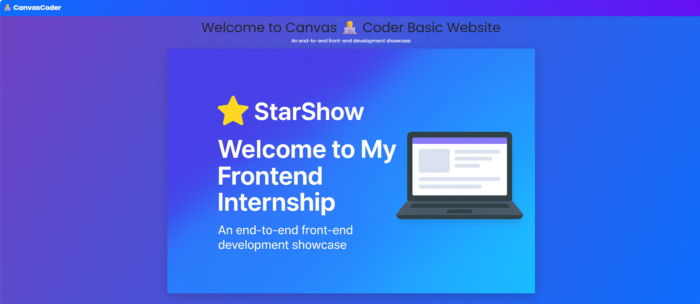
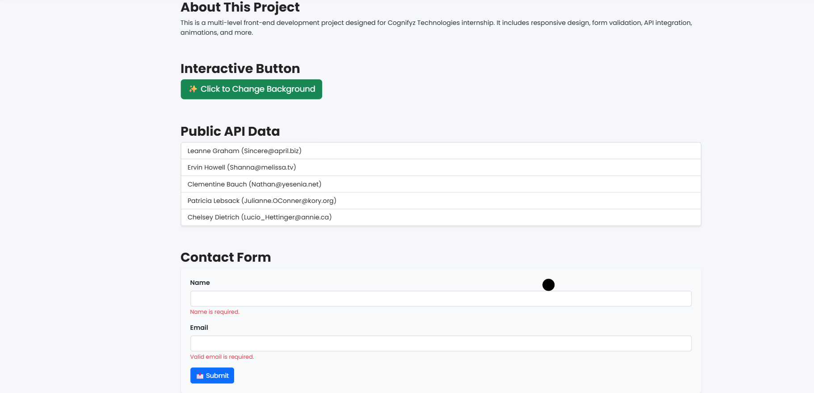

# Cognifyz Technologies - Front-End Internship Project

This repository contains my completed tasks for the **Front-End Development Internship** offered by **Cognifyz Technologies**.

## 🚀 Features & Tasks Completed

✅ Task 1: Basic HTML Page  
✅ Task 2: Inline CSS Styling  
✅ Task 3: Responsive Design using Media Queries  
✅ Task 4: JavaScript Interactive Button  
✅ Task 5: API Integration using JSONPlaceholder  
✅ Task 6: Form Styling and Client-side Validation  
✅ Task 7: Component-Based Layout using Bootstrap  
✅ Task 8: CSS Preprocessing with Sass

## 📂 Project Structure

- `index.html` - Main HTML file
- `styles.css` - Custom CSS for styling
- `styles.scss` - Sass file with variables and nested rules
- `script.js` - JavaScript for interactivity and API
- `assets/` - Folder for images (optional)

## 📸 Demo

## 🛠️ Tools Used

- HTML5  
- CSS3 & Sass  
- JavaScript (ES6)  
- Bootstrap 5  
- JSONPlaceholder API  
- Git & GitHub

## 📢 Connect With Me

- 💼 [LinkedIn](https://www.linkedin.com/in/abhinav-tripathi-770224253/)  
- 💻 [GitHub](https://github.com/0609Abhinav)  
- 📧 Email: abhinavtripathi6sep@gmail.com

---

> Proud to complete this milestone with Cognifyz Technologies 💪
